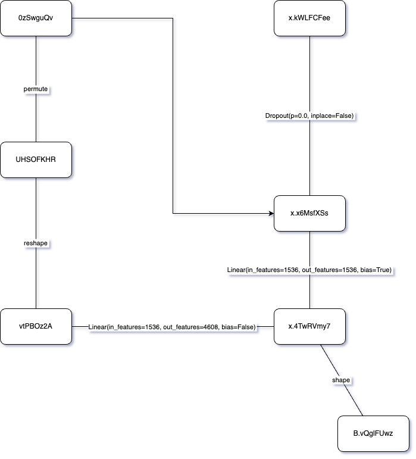

# PyTorch Neural Network Visualizer

[](https://travis-ci.org/user/repo)
[](https://opensource.org/licenses/MIT)
[](https://badge.fury.io/gh/user/repo)



## Overview

This library is designed to generate visualizations of neural networks by analyzing PyTorch code. Unlike conventional methods, our approach eliminates the need for large parameter files (pth) or specific input formats. With minimal AI knowledge, users can leverage this tool to create visualizations that aid in understanding complex networks, including support for transformers and attention mechanisms.

## Installation

Ensure you have Python and PyTorch installed. Install the library using the following command:

<!-- ```bash
pip install your-library
``` -->

## Usage

To generate visualizations, simply provide PyTorch code as input. The library will analyze the code and create visual representations of the neural network. No need for large parameter files or intricate input formats.

```python
import numpy as np
import nnanim.analyzer
from TestingCode import vit
from TestingCode import modules

la = nnanim.analyzer.ModuleAnalyzer()
la.start_analyze_module(modules.Attention(dim=2*768))
```

For the example `TestingCode`, we are using a code base of vit: https://github.com/gupta-abhay/pytorch-vit/tree/main.

## Documentation

<!-- For in-depth instructions and additional details, refer to the [official documentation](https://your-documentation-link.com). -->

## Contribution Guidelines

Contribute to the project by reporting issues or submitting code improvements. Follow the guidelines for raising issues, creating branches, and submitting pull requests.

## Version History

View the project's version history on the [GitHub Releases](https://github.com/user/repo/releases) page.

## License

This project is licensed under the [MIT License](https://opensource.org/licenses/MIT). Refer to the LICENSE file for more information.

## Project Status

Active development status or any relevant project status updates.

## Community and Contact

Engage with the community on our [forum](https://community-forum-link.com) or contact us via email at [your-email@example.com].

## Badges

Display badges indicating project status, build, version, and other relevant information.

## Screenshots or Demos

Include screenshots or links to demos showcasing the visualizations generated by the library.

## Related Projects

Explore other projects or tools related to neural network visualization.

## Frequently Asked Questions (FAQ)

Address common questions users might have about the library and its usage.

## Acknowledgments

Express gratitude to contributors or projects that have influenced or assisted in the development of this library.
```

Replace placeholders like `user/repo`, `your-documentation-link.com`, `your-library`, and others with your actual information. Customize this template based on the specific details and requirements of your project.
